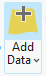

(arcgis:cheatsheet)=
# Interpreting in ArcGIS Pro

ArcGIS Pro is a GIS application sold/maintained by ESRI.
ArcGIS Pro (version 3.2.x and later; released early 2024) have the ability to display 3D Tiled Models ([both .3tz and .json data types, which can be exported from Metashape](#tutorial:export)) natively within the Scene map type. The support goes as far as allowing 3D annotations and interpretations of the data, which allows for tracing of beds, faults and other features. 

University of Oslo should have a licence for this for educational use.

This tutorial details the following steps:

-	Addition of the 3D scene map/viewer
-	Addition of 3D Tiled model data sets that were generated through Agisoft Metashape
-	Interactions with 3D Tiled Models
-	The Creation of 3D vector layers, and the annotation of digital outcrops in 3D.
-   The addition of 3D point cloud data in .las and .laz file formats.


## Enabling 3D map/views

```{figure} assets/arcgis/arcgis_add_3d_map.gif
---
height: 400px
name: arcgis_add_3d_map
---
Animations showing how to enable the 3D map view in ArcGIS Pro.
```

```{figure} assets/arcgis/arcgis_enable_realworldelevation.gif
---
height: 400px
name: arcgis_enableelevation
---
World elevation data can be added into the 3D viewer.
World terrain and orthomosaic surface data and be overlaid onto the 3D elevation data and inspected in the 3D viewer. 
```

(arcgis:3dtiles)=
## 3D Tiled model data in ArcGIS Pro

Unlike QGIS, ArcGIS Pro supports 3D tiles in various formats, including the zipped *.3tz* file format exported from Agisoft Metashape.
Thus, there is no reason to unpack the *.3tz* file into its *.json* component.
Instead, one can simply drag and drop the *.3tz* file from OneDrive/SharePoint into the ArcGIS Pro 3D map window ({numref}`arcgis_add_3dtiledmodel`)
Alternatively, head to the Map menu bar, and then press , browse to the data set, and press {kbd}`OK`.

```{figure} assets/arcgis/arcgis_add_3dtiledmodel.gif
---
height: 400px
name: arcgis_add_3dtiledmodel
---
Drag and drop the 3dtiles archive into the 3D Map window to add the Tiled model to your ArcGIS Project.
```

Once included, why not use the [](arcgis:3dvectors) tutorial and interpret the layers in 3D?


```{figure} assets/arcgis/arcgis_show_model_elevation_options.gif
---
height: 400px
name: arcgis_move
---
Rotating and moving the 3D model: Right-click-hold + move mouse = zoom; Middle-click-hold + move mouse = rotate; left-click-hold + move mouse = drag/move.
```


## Importing .Laz/.Las point cloud data

Although .Laz files can be directly imported into QGIS, ESRI's ArcGIS still struggles with the file format.
However, it does offer a convert tool (called *Convert LAS tool*, {numref}`arcgis_geoprocessing_tools_convertlas`) that can be used to convert .laz to .las files - which it does support.
See also: https://support.esri.com/en-us/knowledge-base/faq-is-it-possible-to-display-laz-files-in-arcgis-pro-000018920

```{admonition} Software compatibility
:class: warning

As of yet, ArcGIS Pro does not support the custom data embedded within the point sets.
So other than the typical point metadata cannot be displayed...
```

```{figure} assets/arcgis/arcgis_geoprocessing_tools.png
---
height: 400px
name: arcgis_geoprocessing_tools
---
Enable the *Geoprocessing* pane by going to *View*>*Geoprocessing*.
```

```{figure} assets/arcgis/arcgis_geoprocessing_convertlas.png
---
height: 400px
name: arcgis_geoprocessing_tools_convertlas
---
Within the *Geoprocessing* pane, search for convert, and the *Convert LAS* tool should be listed.
Click it to open the parameters page for the tool.
```

```{figure} assets/arcgis/arcgis_geoprocessing_convertlas2.png
---
height: 400px
name: arcgis_geoprocessing_tools_convertlas2
---
Select the desired .Laz file from the processed data, then set the same directory in the *Target folder* option.
All is set now - just press *Run* to generate the .las file.
```

```{figure} assets/arcgis/arcgis_add_las_file.gif
---
height: 400px
name: arcgis_add_las_file
---
Drag and drop the generated .las file into the 3D map.
Initially, it will show as a red box. This is the outline of the data.
But once you zoom in, it will show you the points with their colouring based on their elevation.

Note: if the box does not show, it may be that it is "hidden" below the surface (as not totally unexpected...). Simply toggle off the WorldElevation3D/Terrain 3D data to visualise the data.
```

The point colours and appearance can be modified similar to how the vector data appearance was changed in {numref}`arcgis_modify_3d_vector_appearance`.


(arcgis:3dvectors)=
## Creating and editing 3D vectors 

```{figure} assets/arcgis/arcgis_add_3d_vector.gif
---
height: 400px
name: arcgis_add_3dvector
---
Data can be annotated both in 2D and 3D in a similar manner.
Shown here is how to add a 3D vector line, though changing the *Feature Class Type* allows for other types such as *Points* and *Polygons*.
Addition of these follows a similar workflow as outlined here for the *Line* type.
```

```{figure} assets/arcgis/arcgis_modify_3d_vector.gif
---
height: 400px
---
Once created, 3D vectors can be modified; i.e., including their actual creation.
Several options exist, including on how the created features follow the surface (so-called clipping) and more.
Remember: all require you to press *Finish* when done to save them to the created layer.
```

```{figure} assets/arcgis/arcgis_modify_3d_vector_save.gif
---
height: 400px
---
Make sure to save your changes to the layer!
First *Finish* your drawings, then proceed to the *Edit* tab and press *Save*.
```

## Visualising and exploring 3D vectors and their attributes

Vector items can be populated with specific metadata, called attributes.
Think of these as labels that can be read and sorted by the computer, and examples include observations, formations, rock types, etc.
Shown below is how vectors can be populated with attributes.

```{figure} assets/arcgis/arcgis_modify_3d_vector_attributes.gif
---
height: 400px
---
Right click an existing vector layer, then proceed to the attribute table.
This opens a new tab that allows you to add and remove fields.
Once added, you can name the field, and provide it with a data type.
Choose *Text* if you want to describe things, and the *Double* format works well for numbers. 

```

```{figure} assets/arcgis/arcgis_modify_3d_vector_attributes_show.gif
---
height: 400px
---
Attributes can also be used in the labeling of the vectors in the 2D and 3D map views.
Once again, right click the 3D vector, then select *Label*, and then *Label properties*.
This allows you to change the label appearance associated with the vector item.
Try changing the expression to the attribute name that you want to use for the labeling, then proceed to the *Symbol* tab to change fonts and fontsizes.
```

```{figure} assets/arcgis/arcgis_modify_3d_vector_appearance_show.gif
---
height: 400px
name: arcgis_modify_3d_vector_appearance
---
One can also change the appearance of the vector items themselves, changing colour based on the value of an attribute, changing linewidths, and other properties.
Right-click the vector item you want to change, and select *Symbology*.
The *Symbology* tab allows you to change all this; but don't forget to press *Apply* to apply the changes you made!
(Note: this feature is really handy when you have an attribute with specific keywords, then you can colour each keyworded feature accordingly.)
```

```{figure} assets/arcgis/arcgis_modify_3d_vector_appearance_show_3d_remains.gif
---
height: 400px
name: arcgis_vector_saves
---
As you can see, the data are actually annotated in 3D! :)
```